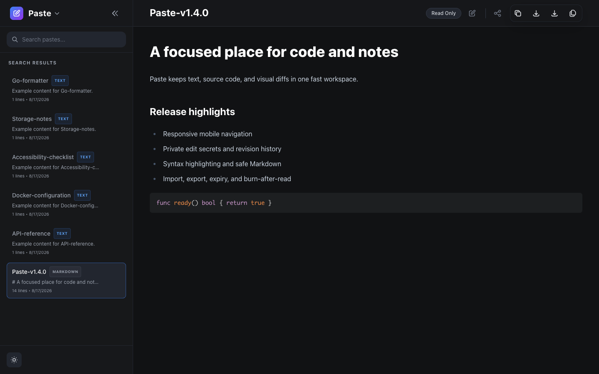
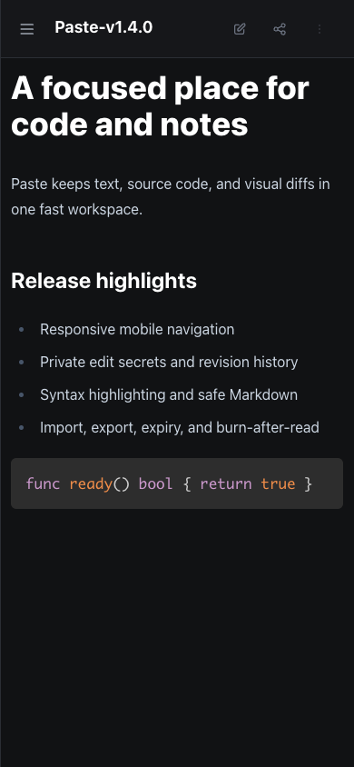
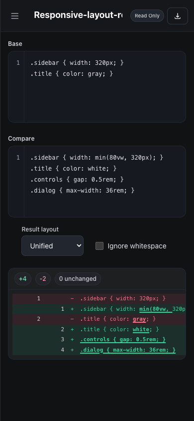
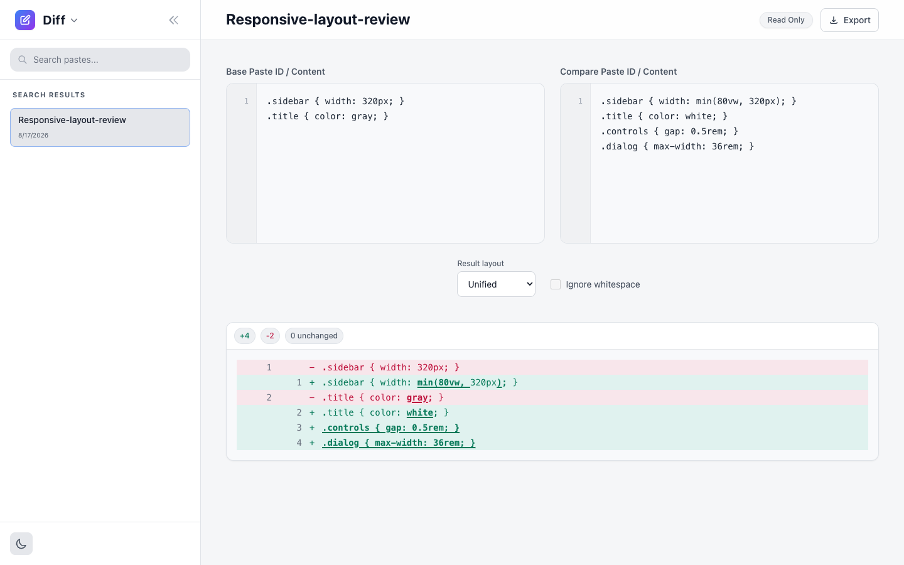

# Paste

A fast, private paste and diff workspace that you can run on your own server.

[](https://go.dev/)
[](https://www.docker.com/)
[](LICENSE)



Paste keeps notes, source code, and visual comparisons in one responsive interface. It stores all data in local files under your control.

## What it does

- Creates, edits, searches, and shares text or source code.
- Renders safe Markdown and highlighted code.
- Compares text in unified or side-by-side views.
- Protects changes with private edit secrets and optional API tokens.
- Keeps revision history and restores earlier content.
- Supports tags, favorites, expiry, and burn-after-read items.
- Imports and exports portable item files.
- Creates verified backups with the included command-line tool.
- Runs without a database or external frontend service.

| Mobile paste | Responsive diff |
|---|---|
|  |  |



## Start with Docker Compose

```bash
git clone https://github.com/arvarik/paste.git
cd paste
cp .env.example .env
docker compose up -d
```

Open [http://localhost:8083](http://localhost:8083).

Compose binds Paste to the local computer by default. Put an HTTPS reverse proxy in front of Paste for remote access.

## Security by default

Each new item receives a 128-bit public ID and a separate edit secret. The browser stores the edit secret only on the current device.

The server limits request rates, item creation, storage, and expensive work. It also sanitizes Markdown and serves pinned local frontend assets.

## Documentation

- [Documentation index](docs/README.md)
- [Getting started](docs/getting-started.md)
- [Configuration](docs/configuration.md)
- [API reference](docs/api.md)
- [Operations and backups](docs/operations.md)
- [Security guide](docs/security.md)
- [Developer guide](docs/development.md)

## License

Paste uses the [MIT License](LICENSE).
